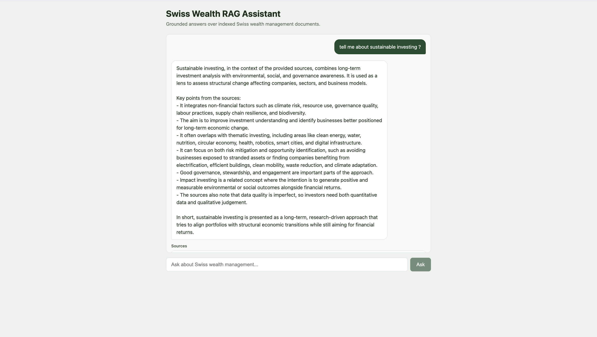
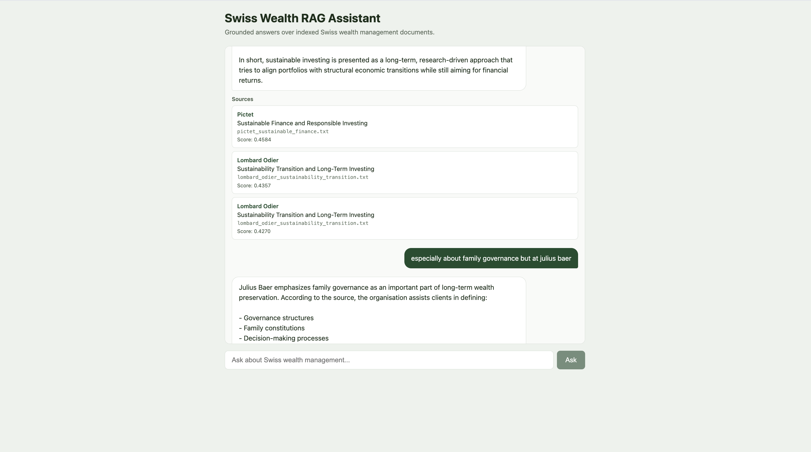
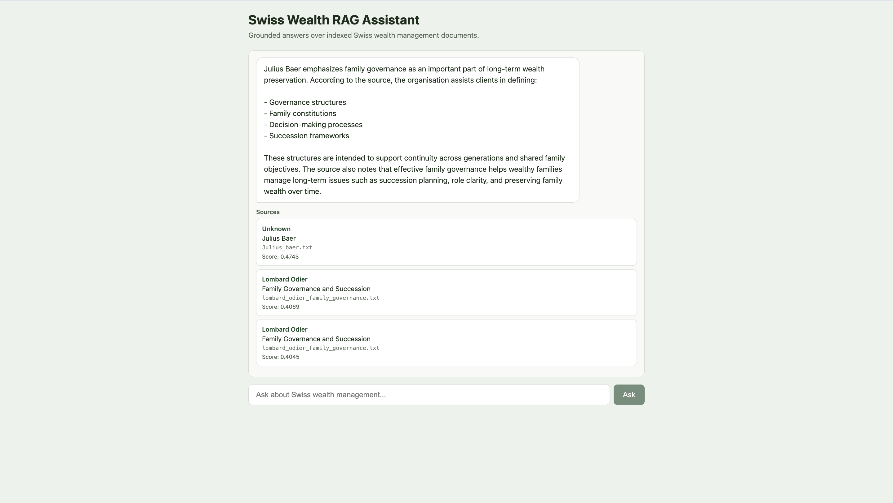
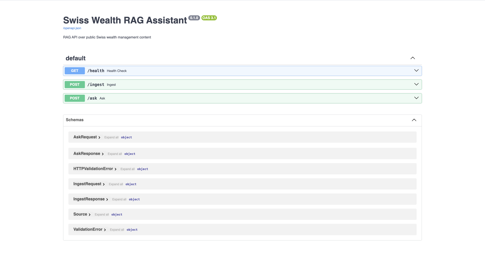
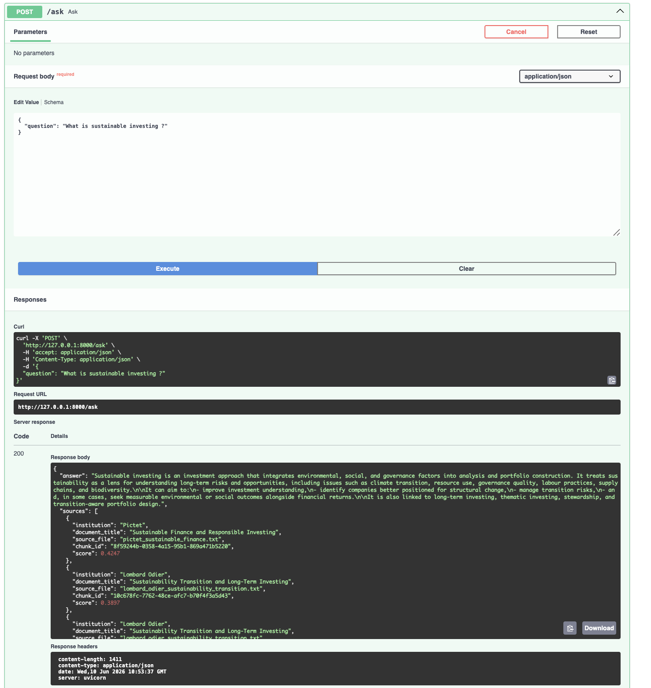

# Swiss Wealth RAG Assistant

A conversational Retrieval-Augmented Generation API over synthetic Swiss wealth management content. The backend ingests documents, embeds them into ChromaDB, classifies user intent, rewrites follow-up questions for retrieval, and generates grounded answers with structured source attribution.

A React chat UI in `frontend/` sends multi-turn conversation history to `POST /ask`. The backend orchestrates intent routing, query rewriting, retrieval, and generation; the UI is a thin client.

## Live demo

| Resource | URL |
| -------- | --- |
| **Chat UI** | [swiss-wealth-rag-assistant.vercel.app](https://swiss-wealth-rag-assistant.vercel.app) |
| **API** | [swiss-wealth-rag-assistant.onrender.com](https://swiss-wealth-rag-assistant.onrender.com) |
| **Swagger** | [swiss-wealth-rag-assistant.onrender.com/docs](https://swiss-wealth-rag-assistant.onrender.com/docs) |
| **Health** | [swiss-wealth-rag-assistant.onrender.com/health](https://swiss-wealth-rag-assistant.onrender.com/health) |

> On Render's free tier, the API may sleep after inactivity (cold start ~30–60s). Re-run `POST /ingest` after each backend redeploy if the vector index was wiped.

### Chat UI









## Stack

| Layer | Technology |
| ----- | ---------- |
| API | FastAPI, Pydantic, Uvicorn |
| RAG | LlamaIndex (load, chunk, retrieve) |
| Vector store | ChromaDB (persistent, local filesystem) |
| Embeddings | OpenAI `text-embedding-3-small` |
| LLM | OpenAI (configurable via `LLM_MODEL`) |
| Frontend | React, TypeScript, Vite (see `frontend/`) |

## How it works

1. **Ingest** — `.txt` files from `data/documents/` are loaded, enriched with institution metadata, chunked, embedded, and stored in ChromaDB.
2. **Classify intent** — each message is routed as `RAG_QUERY`, `ASSISTANT_META`, or `OUT_OF_SCOPE`. Meta and out-of-scope questions skip retrieval.
3. **Rewrite (RAG only)** — follow-up questions are expanded into standalone retrieval queries using conversation history (e.g. *"And what about Pictet?"* → a full comparison question).
4. **Retrieve** — the rewritten query is embedded and matched against the top 3 chunks.
5. **Generate** — if the best score is below `0.35`, the API returns a fixed fallback (no LLM call). Otherwise, the LLM answers using retrieved context and conversation history.
6. **Respond** — the answer is returned with sources: institution, document title, file, chunk ID and relevance score.

On startup, `ensure_index()` runs when `AUTO_INGEST_ON_STARTUP=true` (default) and ingests if the vector store is empty.

## Architecture

```
┌─────────────┐     ┌──────────────┐     ┌─────────────────┐
│   Client    │────▶│   FastAPI    │────▶│  Orchestrator   │
│  (UI/curl)  │     │   POST /ask  │     │  (assistant/)   │
└─────────────┘     └──────────────┘     └────────┬────────┘
                                                  │
                    ┌─────────────────────────────┼─────────────────────────────┐
                    ▼                             ▼                             ▼
             ┌─────────────┐              ┌─────────────┐              ┌─────────────┐
             │   Intent    │              │   Query     │              │  Generator  │
             │ Classifier  │              │  Rewriter   │              │  (prompt)   │
             └──────┬──────┘              └──────┬──────┘              └──────┬──────┘
                    │ meta / Out-of-scope                   │ RAG only            │
                    │ (no retrieval)                 ▼                            │
                    │                       ┌─────────────┐     ┌──────────────┐  │
                    │                       │  Retriever  │────▶│   ChromaDB   │  │
                    │                       │  (top-k)    │     │ vector_store │  │
                    │                       └─────────────┘     └──────────────┘  │
                    │                                                             ▼
                    └─────────────────────────────────────────────────▶ ┌─────────────┐
                                                                        │   OpenAI    │
                                                                        │  LLM + emb. │
                                                                        └─────────────┘
```

## Capabilities

| Feature | Description |
| ------- | ----------- |
| **Multi-turn conversation** | `POST /ask` accepts optional `history`, the UI sends prior turns on each message. |
| **Query rewriting** | Follow-ups are rewritten into standalone retrieval queries before vector search. |
| **Intent routing** | Wealth questions go to RAG, capability questions and off-topic queries get immediate responses without retrieval. |
| **Grounded answers** | RAG responses use retrieved chunks only, low-confidence retrieval triggers a refusal instead of hallucination. |
| **Source attribution** | Each answer includes institution, document, chunk ID and relevance score. |

## Data corpus

**17 synthetic `.txt` files** in `data/documents/`, covering Lombard Odier, UBS, Pictet, and Julius Baer, plus topic documents (sustainability, family governance, digital banking, private markets, and more).

Each file is mapped to an institution and document title via `app/rag/metadata.py` at ingest time.

> **Disclaimer:** These documents are synthetic demonstration content. They are not official publications of any financial institution.

## API

| Method | Endpoint  | Description |
| ------ | --------- | ----------- |
| GET    | `/`       | Service metadata (name, docs, health) |
| GET    | `/health` | Health check |
| POST   | `/ingest` | Index documents from a directory |
| POST   | `/ask`    | Grounded Q&A with sources |

### Example

```bash
curl -X POST http://localhost:8000/ask \
  -H "Content-Type: application/json" \
  -d '{
    "question": "And what about Pictet?",
    "history": [
      {"role": "user", "content": "How does UBS approach sustainable investing?"},
      {"role": "assistant", "content": "UBS integrates sustainability into advisory workflows."}
    ]
  }'
```

Example response:

```json
{
  "answer": "Swiss private banks increasingly integrate sustainability into long-term investment frameworks...",
  "sources": [
    {
      "institution": "Lombard Odier",
      "document_title": "Sustainability Transition and Long-Term Investing",
      "source_file": "lombard_odier_sustainability_transition.txt",
      "chunk_id": "abc123",
      "score": 0.82
    }
  ]
}
```

If retrieval confidence is too low:

> I could not find enough information in the indexed sources to answer this confidently.

**Out-of-scope questions** (e.g. sports, weather) are refused before retrieval. **Meta questions** (e.g. *"What can you do?"*) return a fixed capability description with no sources.

### Swagger UI





## Local setup

```bash
python -m venv .venv
source .venv/bin/activate
pip install -r requirements.txt

cp .env.example .env
# Add OPENAI_API_KEY to .env

uvicorn app.main:app --reload
```

With `AUTO_INGEST_ON_STARTUP=true` (default), the index is built on first startup. Otherwise, call `POST /ingest` before `POST /ask`.

### Tests

```bash
pip install -r requirements.txt -r requirements-dev.txt
pytest
```

### Evaluation

Simple retrieval and fallback checks against a running server:

```bash
python eval/run_eval.py
EVAL_BASE_URL=https://swiss-wealth-rag-assistant.onrender.com python eval/run_eval.py
```

## Docker

```bash
docker build -t swiss-wealth-rag .
docker run -p 8000:8000 --env-file .env swiss-wealth-rag
```

## Deploy

**Backend (Render)** — deploy from the `main` branch.

1. Connect the GitHub repo; set deploy branch to `main`
2. Set environment variables from `.env.example` (at minimum `OPENAI_API_KEY`)
3. Start command: `uvicorn app.main:app --host 0.0.0.0 --port $PORT`
4. After redeploy, call `POST /ingest` or rely on auto-ingest when the store is empty

**Frontend (Vercel)** — deploy the `frontend/` directory. Set `VITE_API_URL` to the Render API URL. Add the Vercel origin to CORS in `app/main.py`.

See `frontend/README.md` for frontend-specific setup.

## Project structure

```
app/
  api/routes.py        # FastAPI endpoints
  assistant/
    orchestrator.py    # Pipeline: intent → rewrite → generate
    intent.py          # Intent classification + meta/Out-of-scope responses
    query_rewriter.py  # Follow-up → standalone retrieval query
  rag/
    ingest.py          # Load, chunk, embed, store
    retriever.py       # Vector search
    generator.py       # Grounded LLM answers
    metadata.py        # Filename → institution, document title
    common.py          # Shared config helpers
  config.py            # Settings from .env
  models/schemas.py    # Request/response models
  main.py              # App, CORS, startup lifespan
data/documents/        # Synthetic source corpus (17 .txt files)
eval/                  # Evaluation script + questions
frontend/              # React chat UI (Vite)
docs/assets/           # Screenshots
tests/                 # pytest suite
vector_store/          # ChromaDB (generated, gitignored)
```

## Limitations

- No authentication
- Single-node ChromaDB (no hosted vector DB)
- English only
- Synthetic documents only
- No URL ingestion yet (planned)
- Intent classification and query rewriting add extra LLM calls per RAG turn
