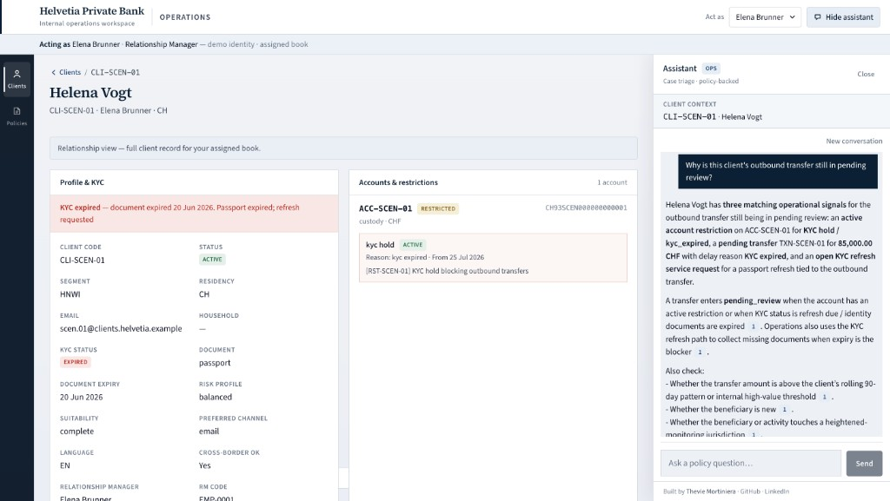
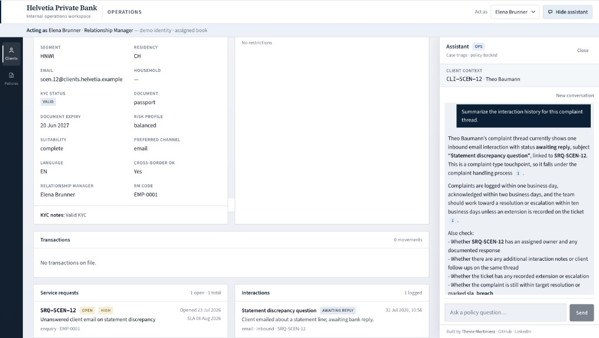
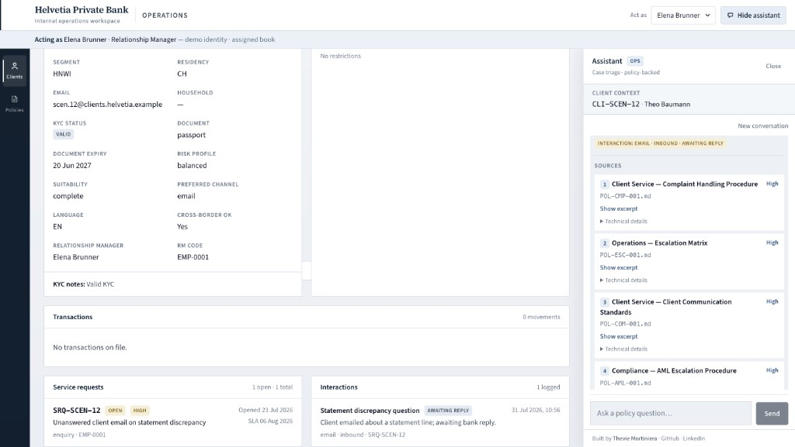
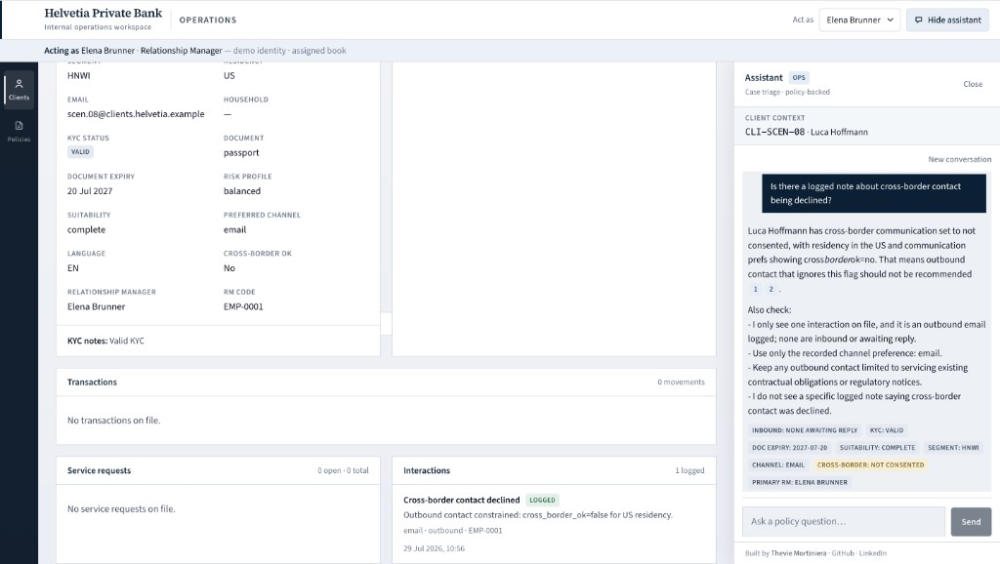
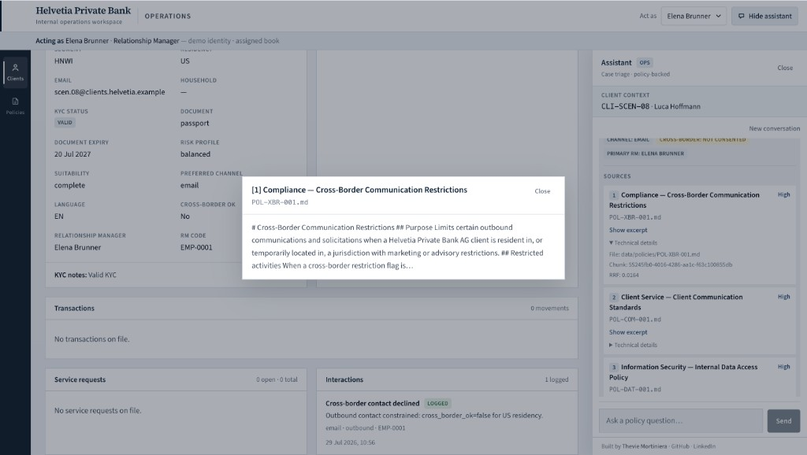
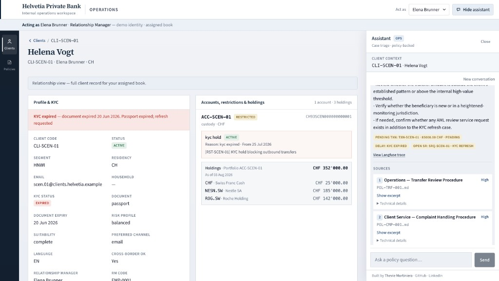
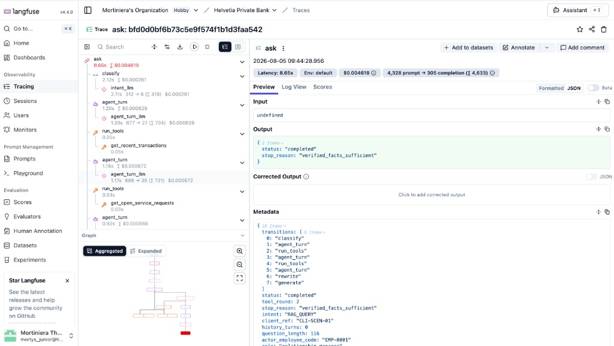

# Swiss Wealth RAG Assistant

Internal **Helvetia Private Bank** operations workspace: browse structured clients and policies, then ask a docked assistant grounded on **client book facts + indexed policies**. The backend runs a bounded ReAct agent (verify assertions with read-only tools, search policies when needed, then generate), hybrid retrieval (vector + FTS + RRF), and returns answers with **evidence chips** and source attribution.

The React UI in `frontend/` is software-first (client book + policy catalog); `POST /ask` powers the assistant panel with optional selected-client context.

## Live demo

| Resource | URL |
| -------- | --- |
| **Operations UI** | [swiss-wealth-rag-assistant.vercel.app](https://swiss-wealth-rag-assistant.vercel.app) |
| **API** | [swiss-wealth-rag-assistant.onrender.com](https://swiss-wealth-rag-assistant.onrender.com) |
| **Swagger** | [swiss-wealth-rag-assistant.onrender.com/docs](https://swiss-wealth-rag-assistant.onrender.com/docs) |
| **Health** | [swiss-wealth-rag-assistant.onrender.com/health](https://swiss-wealth-rag-assistant.onrender.com/health) |

> On Render's free tier, the API may sleep after inactivity (cold start ~30–60s). If the hosted Postgres knowledge tables are empty, the API auto-ingests Helvetia policies on startup (`AUTO_INGEST=true`, requires `OPENAI_API_KEY`). If the banking domain has no employees, it auto-seeds synthetic clients (`AUTO_SEED=true`). Set `SEED_DATA_VERSION` on Render when seed scripts change so the next deploy truncates and reseeds the demo domain (no shell). Neon data persists across restarts, so cold starts do not re-embed unless the knowledge store is empty.

### Operations UI (production)

Screenshots from the [live demo](https://swiss-wealth-rag-assistant.vercel.app) — curated `CLI-SCEN-*` scenarios, Act-as RM identity.

**SCEN-01 — expired KYC, account restriction, pending transfer triage.** The assistant verifies book facts (KYC hold, pending TXN-SCEN-01, open SRQ) and cites policy for why the transfer is in pending review.



**SCEN-12 — complaint thread and interaction history.** Open SRQ + inbound email awaiting reply; answer grounded on interaction log and complaint-handling policy.



**SCEN-12 — policy sources.** Retrieved chunks with department, document, and relevance score; expandable chunk metadata for audit.



**SCEN-08 — cross-border contact declined.** Assistant reads `cross_border_ok=false` from profile/comms and the logged interaction — no invented notes.



**SCEN-08 — policy reader modal.** Click a source chip to open the full policy document in the workspace reader.



See [demo scenarios](docs/demo-scenarios/scenarios.md) for all 15 curated client packs and suggested prompts.

## Stack

| Layer | Technology |
| ----- | ---------- |
| API | FastAPI, Pydantic, Uvicorn |
| Domain DB | PostgreSQL 16 + SQLAlchemy + Alembic |
| Knowledge / vectors | pgvector (hybrid: cosine + Postgres FTS + RRF) |
| Embeddings | OpenAI `text-embedding-3-small` |
| LLM | OpenAI (configurable via `LLM_MODEL`) |
| Observability | Langfuse (opt-in; traces per `/ask` when keys set) |
| Frontend | React, TypeScript, Vite (see `frontend/`) |

## How it works

**Policy-only questions** (no client selected): classify → rewrite (if history) → hybrid retrieve → generate → sources.

**Client case questions** (client open in dock):

1. **Classify intent** — `RAG_QUERY`, `ASSISTANT_META`, or `OUT_OF_SCOPE`.
2. **Agent loop** (bounded ReAct) — planner chooses each turn: call a read-only client tool, `search_internal_policies`, or finish. Verifies what the user asserted (e.g. pending transfer, restriction) against book data before answering.
3. **Client tools** — profile/KYC, account summary, restrictions, transactions, service requests, interaction history (Act-as scoped).
4. **Policy search in loop** — hybrid retrieval when procedure/SLA/rules are needed; generate reuses those hits.
5. **Rewrite + generate** — standalone retrieval query from history; LLM answers from structured facts + policy context.
6. **Respond** — answer with **evidence chips** (book facts) and **sources** (policy chunks: department, title, chunk ID, score).

**Ingest policies** — Markdown under `data/policies/` is validated, chunked, embedded, and stored in `knowledge_*` tables (`POST /ingest` or `scripts/ingest_policies.py`).

**Seed domain** — synthetic clients and 15 curated scenarios in PostgreSQL (`scripts/seed_db.py` or `SEED_DATA_VERSION` on deploy).

## Architecture

```
┌─────────┐     ┌──────────────┐     ┌──────────────┐
│ Client  │────▶│   FastAPI    │────▶│ Orchestrator │
│(UI/curl)│     │  POST /ask   │     │ (agent/)     │
└─────────┘     └──────────────┘     └──────┬───────┘
                                            │
                                            ▼
                                  ┌──────────────────┐
                                  │ Intent classifier │
                                  └────────┬─────────┘
                                           │
              ┌────────────────────────────┼────────────────────────────┐
              ▼                            ▼                            ▼
       ASSISTANT_META                 OUT_OF_SCOPE                   RAG_QUERY
       fixed response                 fixed response                       │
                                                                           │
                              ┌────────────────────────────────────────────┤
                              │ no client_ref in question                  │ client_ref present
                              ▼                                            ▼
                     Query rewriter                              ┌─────────────────────┐
                     (if history)                              │ Agent turn (ReAct)  │
                              │                                │ call_tool | search  │
                              │                                │ _policies | finish  │
                              │                                └──────────┬──────────┘
                              │                                           │
                              │                    ┌──────────────────────┼──────────────────────┐
                              │                    ▼                      ▼                      ▼
                              │             run_tools              search_policies          finish
                              │         (read-only client              │                      │
                              │          tools → PostgreSQL)           ▼                      │
                              │                    │            app.retrieval (hybrid)          │
                              │                    │            PostgreSQL + pgvector           │
                              │                    └──────── loop (max rounds) ────────────────┘
                              │                                           │
                              └───────────────────────┬───────────────────┘
                                                      ▼
                                             Query rewriter (if history)
                                                      │
                                                      ▼
                                             Generator → OpenAI
                                             (tool facts + policy hits;
                                              retrieve at generate if
                                              loop did not search policies)
                                                      │
                                                      ▼
                                    answer + policy sources + evidence chips
```

Policy-only questions skip the agent loop. Client-case questions (`client_ref` in the question or selected-client context) run the bounded ReAct loop before rewrite and generate. See [system architecture](docs/architecture/system.md) for the full runtime diagram.

## Capabilities

| Feature | Description |
| ------- | ----------- |
| **Operations workspace** | Client directory (open-items: KYC / restrictions / pending transfers / SRs), profile/KYC, accounts with holdings, transactions, interactions, and policy catalog with a docked assistant. |
| **Bounded ReAct agent** | Verify-then-answer loop: structured turns call client tools and/or policy search before generating a case triage response. |
| **Evidence chips** | Book facts surfaced on answers (KYC, restrictions, pending txns, open SRs, interactions, holdings) — separate from policy source citations. |
| **Demo Act-as identity** | Pick an employee (`X-Helvetia-Actor`); RM books are assigned-only; policies/`/ask` respect `allowed_roles`. Not login — full RBAC later. |
| **Selected-client context** | Opening a client tags the assistant dock; the agent extracts `client_ref` and runs the tool loop. |
| **Scenario prompts** | 15 curated `CLI-SCEN-*` packs with suggested operator questions in the UI. |
| **Multi-turn conversation** | `POST /ask` accepts optional `history`; the UI sends prior turns on each message. |
| **Intent routing** | Wealth/case questions go to RAG + tools; capability and off-topic queries skip retrieval. |
| **Grounded answers** | Responses use structured facts and retrieved policy chunks only; empty-book honesty (no invented pending transfers or tickets). |
| **Source attribution** | Policy hits include department, document, chunk ID, RRF score; clickable in the UI policy reader. |
| **Langfuse tracing** | Opt-in end-to-end `/ask` traces: workflow steps, per-tool spans, LLM generations with tokens/cost. Dev UI shows a trace link when `APP_ENV=dev`. |

## Observability (Langfuse)

Tracing is **optional**. Without Langfuse keys the API behaves exactly as before.

**Enable locally** (copy from `.env.example`):

```bash
APP_ENV=dev
LANGFUSE_PUBLIC_KEY=pk-lf-...
LANGFUSE_SECRET_KEY=sk-lf-...
LANGFUSE_BASE_URL=https://cloud.langfuse.com   # EU; use https://us.cloud.langfuse.com for US
```

After `docker compose up --build`, each `/ask` creates a trace in your Langfuse project. In **dev**, the assistant shows **View Langfuse trace** under the answer (opens the full timeline: tools, generations, metadata).





**Production (Render):** set `APP_ENV=prod`. Langfuse keys may stay set for backend tracing, but `/ask` **never** returns `trace_url` — enforced server-side, not UI-only.

See [ADR-009](docs/adr/ADR-009-langfuse-tracing.md) and [release v0.8](docs/releases/v0.8.md).

## Data corpus

Fictional Helvetia internal policies under `data/policies/` (Markdown + YAML frontmatter): KYC, AML, transfers, restrictions, complaints, SLAs, communication, and related procedures. Active / superseded / draft versions are supported; default retrieval uses **active** only.

Read-only structured banking data (clients, accounts, scenarios) lives in PostgreSQL — see `docs/architecture/`.

> **Disclaimer:** All content is synthetic demonstration data. It is not affiliated with any real bank or regulator.

## API

Interactive OpenAPI docs: **`/docs`** when the API is running (schemas match the current code).

| Method | Endpoint | Description |
| ------ | -------- | ----------- |
| GET | `/` | Service metadata |
| GET | `/health` | Health check |
| GET | `/actors` | Demo employees for Act-as picker |
| GET | `/actors/{code}/workspace` | Scope + panel layout for an actor |
| GET | `/clients` | Client directory (scoped when `X-Helvetia-Actor` set) |
| GET | `/clients/{client_ref}` | Client profile |
| GET | `/clients/{client_ref}/accounts` | Accounts, restrictions, holdings |
| GET | `/clients/{client_ref}/transactions` | Recent transactions |
| GET | `/clients/{client_ref}/interactions` | Interaction history |
| GET | `/clients/{client_ref}/service-requests` | Open service requests |
| GET | `/policies` | Policy catalog (role-filtered when actor set) |
| GET | `/policies/{document_id}` | Policy document body + metadata |
| POST | `/ingest` | Ingest policies from `data/policies/` into Postgres + pgvector |
| POST | `/ask` | Assistant Q&A: answer, policy `sources`, tool `evidence` |

Optional header on workspace routes: **`X-Helvetia-Actor: EMP-0001`** (demo employee code).

### `POST /ask` examples

**Policy follow-up** (no client context — agent loop skipped):

```bash
curl -s -X POST http://localhost:8000/ask \
  -H "Content-Type: application/json" \
  -d '{
    "question": "And if the identity document is expired?",
    "history": [
      {"role": "user", "content": "What is the KYC refresh interval for elevated-risk clients?"},
      {"role": "assistant", "content": "Elevated-risk clients must be refreshed at least every 12 months under the active KYC policy."}
    ]
  }'
```

**Client case** (opens the ReAct loop — use a curated scenario client):

```bash
curl -s -X POST http://localhost:8000/ask \
  -H "Content-Type: application/json" \
  -H "X-Helvetia-Actor: EMP-0001" \
  -d '{
    "question": "Regarding Helvetia client CLI-SCEN-01 (Helena Vogt): Why is the outbound transfer delayed?"
  }'
```

Typical response shape:

```json
{
  "answer": "...",
  "sources": [
    {
      "institution": "Compliance",
      "document_title": "KYC Refresh Policy",
      "source_file": "data/policies/POL-KYC-002.md",
      "chunk_id": "…",
      "score": 0.016,
      "text": "…"
    }
  ],
  "evidence": [
    {
      "label": "KYC",
      "value": "Expired — refresh due",
      "source": "client_profile"
    }
  ]
}
```

`evidence` is populated when the agent loop ran client tools; policy-only questions may return an empty array. With Langfuse enabled and `APP_ENV=dev`, responses may also include `trace_url` (omitted in production).

If retrieval returns no hits and there are no tool facts:

> I could not find enough information in the indexed sources to answer this confidently.

**Out-of-scope** questions (sports, weather, etc.) are refused before retrieval. **Meta** questions (*"What can you do?"*) return a fixed capability blurb with no sources.

## Local setup

**Preferred — Docker Compose** (API + Postgres + frontend + pgAdmin):

```bash
cp .env.example .env
# Required: OPENAI_API_KEY
# Defaults: APP_ENV=dev, AUTO_SEED=true, AUTO_INGEST=true
# Optional: LANGFUSE_* for tracing (see Observability above)

docker compose up --build
```

| Service | URL |
| ------- | --- |
| Operations UI | http://localhost:5173 |
| API / OpenAPI | http://localhost:8000/docs |
| pgAdmin | http://localhost:5050 |

On **first boot** with an empty database, the API runs migrations, auto-seeds the banking domain (`AUTO_SEED`), and auto-ingests policies (`AUTO_INGEST`, requires `OPENAI_API_KEY`). Curated `CLI-SCEN-*` scenarios are included in the seed.

**Manual refresh** (optional — force reseed or re-embed):

```bash
docker compose exec api python scripts/seed_db.py
docker compose exec api python scripts/ingest_policies.py
```

Or bump `SEED_DATA_VERSION` in `.env` / Render env and restart — the API reseeds once when the version exceeds the last applied marker (see `app/main.py` startup logic).

Production UI is on Vercel; the Compose `frontend` service is Vite **dev** for local work only.

**Alternative — Python venv** (API only):

```bash
python -m venv .venv && source .venv/bin/activate
pip install -r requirements.txt -r requirements-dev.txt
cp .env.example .env   # add OPENAI_API_KEY

alembic upgrade head
uvicorn app.main:app --reload
```

Run the UI from `frontend/` (`npm install && npm run dev`) with `VITE_API_URL=http://localhost:8000`.

### Tests

```bash
pytest
# or: docker compose --profile test run --rm test
```

### Evaluation

Helvetia policy golden set (`eval/cases.json`): hybrid **retrieval** metrics plus a thin **`/ask`** suite. Requires migrations, ingested policies, and `OPENAI_API_KEY`.

```bash
python eval/run_eval.py
EVAL_SUITES=retrieval python eval/run_eval.py
# Compose: docker compose --profile eval run --rm eval
```

## Docker image (API)

For a standalone API container (Compose is recommended locally):

```bash
docker build -t swiss-wealth-rag .
docker run -p 8000:8000 --env-file .env swiss-wealth-rag
```

## Deploy

**Backend (Render)** — deploy from the `main` branch.

1. Connect the GitHub repo; set deploy branch to `main`
2. Set environment variables from `.env.example` (at minimum `OPENAI_API_KEY` and `DATABASE_URL` for hosted Postgres). Set **`APP_ENV=prod`** on Render. Langfuse keys are optional (`LANGFUSE_PUBLIC_KEY`, `LANGFUSE_SECRET_KEY`, `LANGFUSE_BASE_URL`) — tracing runs when set; trace links are never exposed in prod.
3. Use the repo `Dockerfile` (migrate on start; leave Render Docker Command empty)
4. With `AUTO_INGEST=true` (default), an empty knowledge store is filled on first boot; use `POST /ingest` to force a refresh. With `AUTO_SEED=true` (default), an empty banking domain is seeded once. When seed scripts change, bump `SEED_DATA_VERSION` on Render before deploy — the API truncates and reseeds the banking domain once on startup (no Render shell required).

**Frontend (Vercel)** — deploy the `frontend/` directory. Set `VITE_API_URL` to the Render API URL. Add the Vercel origin to CORS in `app/main.py`.

See `frontend/README.md` for frontend-specific setup.

## Project structure

```
app/
  api/                 # FastAPI routes (core + clients)
  agent/               # Bounded workflow: state, routing, nodes
  tools/               # Read-only tools (typed I/O, timeouts)
  retrieval/           # Hybrid pgvector + FTS + RRF
  rag/
    policy_registry.py # Load/validate data/policies
    policy_ingest.py   # Chunk, embed, upsert to Postgres
    generator.py       # Grounded LLM answers
    common.py          # Embedding/LLM helpers
  observability/       # Opt-in Langfuse init + tracing helpers
  database/            # SQLAlchemy models, seed
  config.py
  main.py
data/policies/         # Helvetia internal policy corpus
scripts/               # seed_db.py, ingest_policies.py
frontend/              # React operations workspace UI
docs/                  # Architecture, ADRs, releases
tests/
```

## Documentation

- [System architecture](docs/architecture/system.md) · [Domain](docs/architecture/domain.md) · [Demo scenarios](docs/demo-scenarios/scenarios.md)
- [Release notes](docs/releases/) (latest: [v0.8](docs/releases/v0.8.md))
- [ADRs](docs/adr/) (latest: [ADR-009 Langfuse tracing](docs/adr/ADR-009-langfuse-tracing.md))

## Limitations

- No authentication
- English only
- Synthetic Helvetia data only
- Intent classification and query rewriting add extra LLM calls per RAG turn
- Hosted demo uses managed Postgres (Neon) + Render; empty knowledge store auto-ingests and empty domain auto-seeds on startup when `AUTO_INGEST` / `AUTO_SEED` are true
