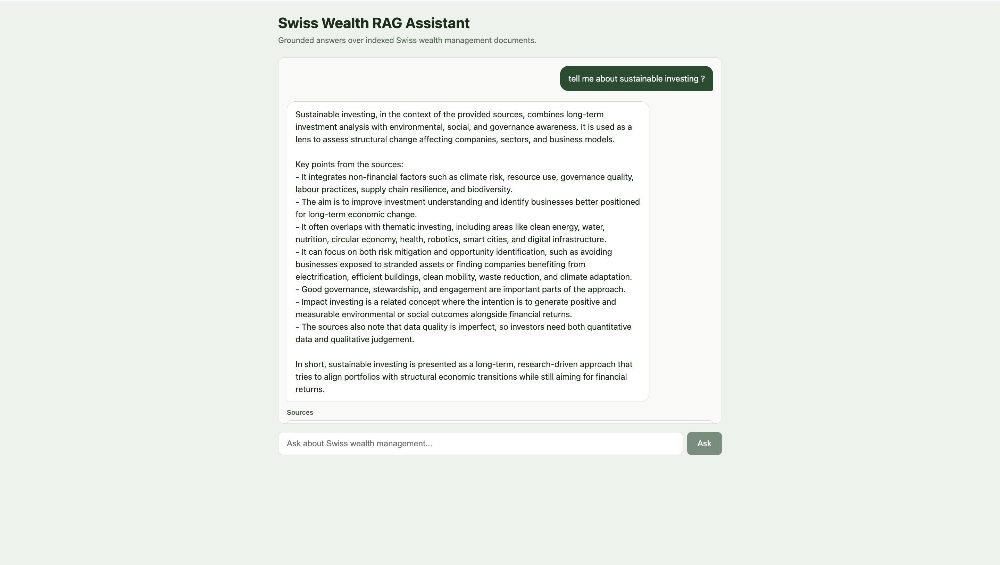
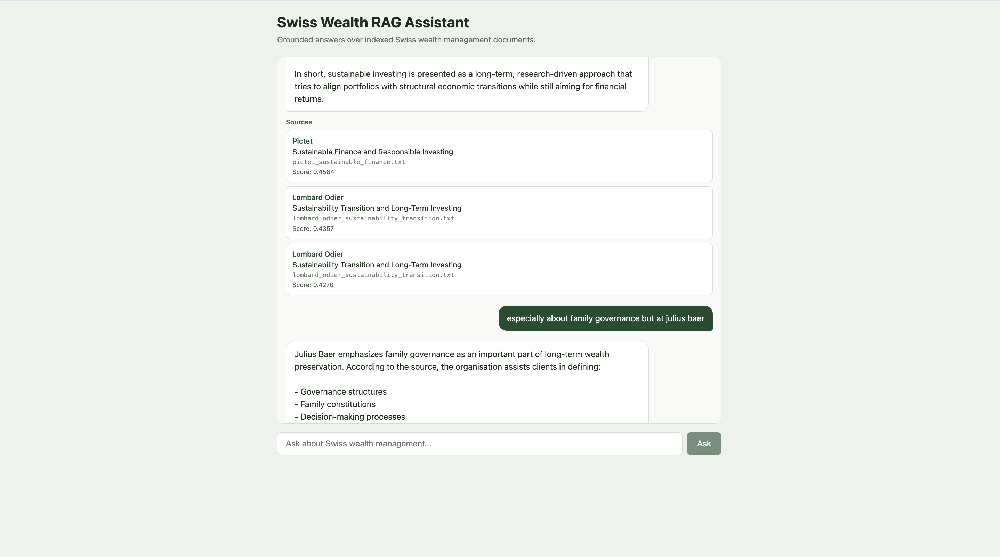
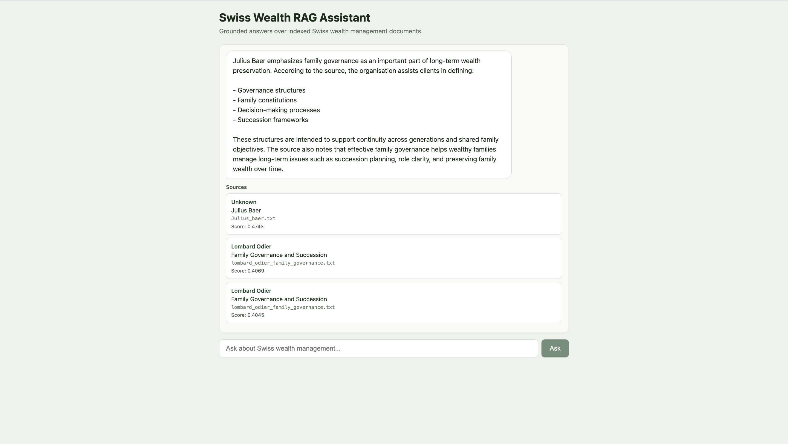
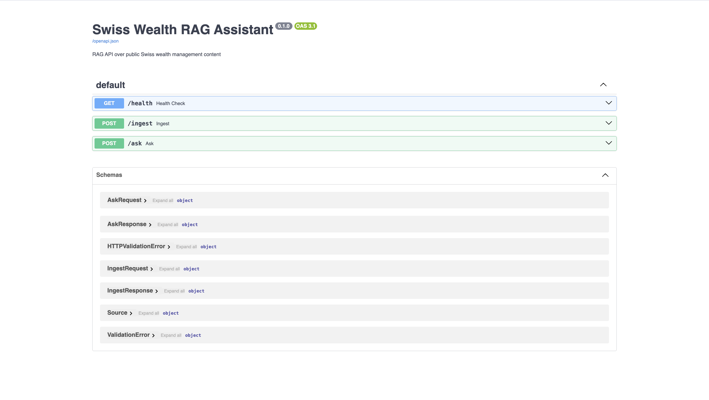
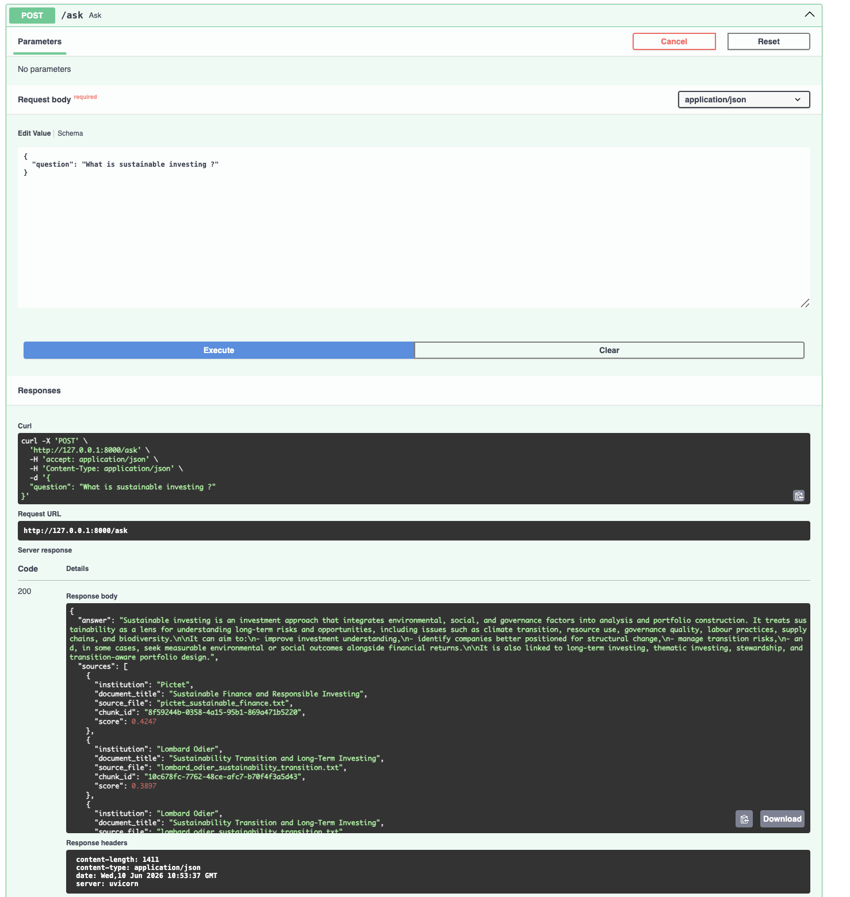

# Swiss Wealth RAG Assistant

Internal operations assistant for fictional **Helvetia Private Bank**: grounded policy Q&A over Postgres + pgvector, plus read-only structured client APIs. The backend classifies intent, rewrites follow-ups, runs hybrid retrieval (vector + FTS), and returns answers with source attribution.

A React chat UI in `frontend/` sends multi-turn conversation history to `POST /ask`.

## Live demo

| Resource | URL |
| -------- | --- |
| **Chat UI** | [swiss-wealth-rag-assistant.vercel.app](https://swiss-wealth-rag-assistant.vercel.app) |
| **API** | [swiss-wealth-rag-assistant.onrender.com](https://swiss-wealth-rag-assistant.onrender.com) |
| **Swagger** | [swiss-wealth-rag-assistant.onrender.com/docs](https://swiss-wealth-rag-assistant.onrender.com/docs) |
| **Health** | [swiss-wealth-rag-assistant.onrender.com/health](https://swiss-wealth-rag-assistant.onrender.com/health) |

> On Render's free tier, the API may sleep after inactivity (cold start ~30–60s). If the hosted Postgres knowledge tables are empty, the API auto-ingests Helvetia policies on startup (`AUTO_INGEST=true`, requires `OPENAI_API_KEY`). Neon data persists across restarts, so cold starts do not re-embed.

### Chat UI









## Stack

| Layer | Technology |
| ----- | ---------- |
| API | FastAPI, Pydantic, Uvicorn |
| Domain DB | PostgreSQL 16 + SQLAlchemy + Alembic |
| Knowledge / vectors | pgvector (hybrid: cosine + Postgres FTS + RRF) |
| Embeddings | OpenAI `text-embedding-3-small` |
| LLM | OpenAI (configurable via `LLM_MODEL`) |
| Frontend | React, TypeScript, Vite (see `frontend/`) |

## How it works

1. **Ingest policies** — Markdown under `data/policies/` is validated, chunked, embedded, and stored in `knowledge_*` tables (`POST /ingest` or `scripts/ingest_policies.py`).
2. **Classify intent** — each message is routed as `RAG_QUERY`, `ASSISTANT_META`, or `OUT_OF_SCOPE`. Meta and out-of-scope questions skip retrieval.
3. **Rewrite (RAG + history only)** — on follow-up turns, the question is expanded into a standalone retrieval query. First questions skip this step.
4. **Retrieve** — hybrid search over active policies (pgvector + FTS, merged with RRF).
5. **Generate** — if there are no hits, the API abstains (no LLM call). Otherwise the LLM answers from retrieved policy context and conversation history.
6. **Respond** — the answer is returned with sources: department (in `institution`), document title, file, chunk ID, and score.

## Architecture

```
┌─────────┐     ┌──────────────┐     ┌──────────────┐
│ Client  │────▶│   FastAPI    │────▶│ Orchestrator │
│(UI/curl)│     │  POST /ask   │     │ (assistant/) │
└─────────┘     └──────────────┘     └──────┬───────┘
                                            │
                                            ▼
                                  ┌──────────────────┐
                                  │ Intent Classifier │
                                  └────────┬─────────┘
                                           │
              ┌────────────────────────────┼────────────────────────────┐
              ▼                            ▼                            ▼
       ASSISTANT_META                 OUT_OF_SCOPE                   RAG_QUERY
       fixed response                 fixed response                       │
                                                                           ▼
                                                                  Query rewriter
                                                                  (if history)
                                                                           │
                                                                           ▼
                                                              app.retrieval (hybrid)
                                                                           │
                                                                           ▼
                                                              PostgreSQL + pgvector
                                                                           │
                                                                           ▼
                                                               Generator → OpenAI
```

## Capabilities

| Feature | Description |
| ------- | ----------- |
| **Multi-turn conversation** | `POST /ask` accepts optional `history`, the UI sends prior turns on each message. |
| **Query rewriting** | Follow-ups are rewritten into standalone retrieval queries before vector search. |
| **Intent routing** | Wealth questions go to RAG, capability questions and off-topic queries get immediate responses without retrieval. |
| **Grounded answers** | RAG responses use retrieved chunks only, low-confidence retrieval triggers a refusal instead of hallucination. |
| **Source attribution** | Each answer includes department, document, chunk ID and relevance score. |

## Data corpus

Fictional Helvetia internal policies under `data/policies/` (Markdown + YAML frontmatter): KYC, AML, transfers, restrictions, complaints, SLAs, communication, and related procedures. Active / superseded / draft versions are supported; default retrieval uses **active** only.

Read-only structured banking data (clients, accounts, scenarios) lives in PostgreSQL — see `docs/architecture/`.

> **Disclaimer:** All content is synthetic demonstration data. It is not affiliated with any real bank or regulator.

## API

| Method | Endpoint  | Description |
| ------ | --------- | ----------- |
| GET    | `/`       | Service metadata (name, docs, health) |
| GET    | `/health` | Health check |
| POST   | `/ingest` | Ingest Helvetia policies into Postgres + pgvector |
| POST   | `/ask`    | Grounded policy Q&A with sources |

### Example

```bash
curl -X POST http://localhost:8000/ask \
  -H "Content-Type: application/json" \
  -d '{
    "question": "And if the identity document is expired?",
    "history": [
      {"role": "user", "content": "What is the KYC refresh interval for elevated-risk clients?"},
      {"role": "assistant", "content": "Elevated-risk clients must be refreshed at least every 12 months under the active KYC policy."}
    ]
  }'
```

Example response:

```json
{
  "answer": "If a passport is past its expiry date, activity that increases risk must be held pending refresh unless Compliance grants a time-limited exception. [1]",
  "sources": [
    {
      "institution": "Compliance",
      "document_title": "KYC Refresh Policy",
      "source_file": "data/policies/POL-KYC-002.md",
      "chunk_id": "abc123",
      "score": 0.016
    }
  ]
}
```

If retrieval returns no hits:

> I could not find enough information in the indexed sources to answer this confidently.

**Out-of-scope questions** (e.g. sports, weather) are refused before retrieval. **Meta questions** (e.g. *"What can you do?"*) return a fixed capability description with no sources.

### Swagger UI





## Local setup

**Preferred — Docker Compose (API + Postgres + frontend + pgAdmin):**

```bash
cp .env.example .env
# Add OPENAI_API_KEY to .env

docker compose up --build
```

| Service | URL |
| ------- | --- |
| Chat UI | http://localhost:5173 |
| API / Swagger | http://localhost:8000/docs |
| pgAdmin | http://localhost:5050 |

On first run (or after an empty DB), seed clients and ingest policies:

```bash
docker compose exec api python scripts/seed_db.py
docker compose exec api python scripts/ingest_policies.py
```

The API container runs `alembic upgrade head` on start. Production UI remains on Vercel; the Compose frontend is Vite **dev** for local DX only.

**Alternative — Python venv (API only):**

```bash
python -m venv .venv
source .venv/bin/activate
pip install -r requirements.txt

cp .env.example .env
# Add OPENAI_API_KEY to .env

uvicorn app.main:app --reload
```

Then run the UI from `frontend/` (`npm run dev`) or point Compose at an already-running API.

### Tests

```bash
pip install -r requirements.txt -r requirements-dev.txt
pytest
```

Or via Compose (does not start by default — use the `test` profile):

```bash
docker compose --profile test run --rm test
```

### Evaluation

Helvetia policy golden set (`eval/cases.json`, ≥40 cases): hybrid **retrieval** metrics (Recall@k, MRR, active-doc / filter traps) plus a thin **`/ask`** suite (meta, out-of-scope, RAG smokes).

Prerequisites: migrations applied, policies ingested, `OPENAI_API_KEY` set. For the ask suite, the API must be reachable.

```bash
# Local
python eval/run_eval.py
EVAL_SUITES=retrieval python eval/run_eval.py

# Compose one-shot (api + postgres already up and ingested)
docker compose --profile eval run --rm eval
```

## Docker

```bash
docker compose up --build
docker build -t swiss-wealth-rag .
docker run -p 8000:8000 --env-file .env swiss-wealth-rag
```

## Deploy

**Backend (Render)** — deploy from the `main` branch.

1. Connect the GitHub repo; set deploy branch to `main`
2. Set environment variables from `.env.example` (at minimum `OPENAI_API_KEY` and `DATABASE_URL` for hosted Postgres)
3. Use the repo `Dockerfile` (migrate on start; leave Render Docker Command empty)
4. With `AUTO_INGEST=true` (default), an empty knowledge store is filled on first boot; use `POST /ingest` to force a refresh

**Frontend (Vercel)** — deploy the `frontend/` directory. Set `VITE_API_URL` to the Render API URL. Add the Vercel origin to CORS in `app/main.py`.

See `frontend/README.md` for frontend-specific setup.

## Project structure

```
app/
  api/                 # FastAPI routes (core + clients)
  assistant/           # Intent → rewrite → generate
  retrieval/           # Hybrid pgvector + FTS + RRF
  rag/
    policy_registry.py # Load/validate data/policies
    policy_ingest.py   # Chunk, embed, upsert to Postgres
    generator.py       # Grounded LLM answers
    common.py          # Embedding/LLM helpers
  database/            # SQLAlchemy models, seed
  config.py
  main.py
data/policies/         # Helvetia internal policy corpus
scripts/               # seed_db.py, ingest_policies.py
frontend/              # React chat UI
docs/                  # Architecture + ADRs
tests/
```

## Limitations

- No authentication
- English only
- Synthetic Helvetia data only
- Intent classification and query rewriting add extra LLM calls per RAG turn
- Hosted demo uses managed Postgres (Neon) + Render; empty knowledge store auto-ingests on startup when `AUTO_INGEST=true`
