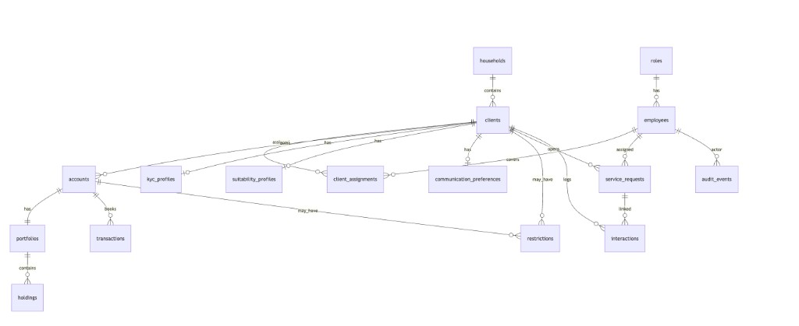
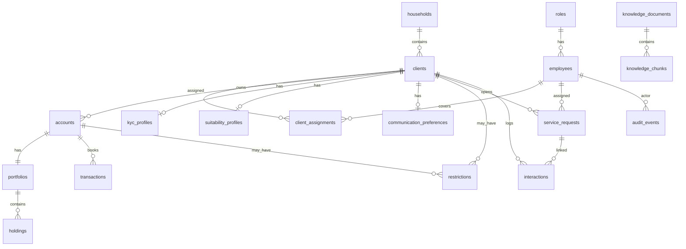

# Database Schema State

**As of:** v0.4 incremental (Alembic head `0002_pgvector_knowledge`)

Current PostgreSQL schema for the Helvetia structured domain and knowledge tables. Field-level definitions live in [data-model.md](data-model.md).

## Migration state

| Item | Value |
| ---- | ----- |
| Engine | PostgreSQL 16 + pgvector |
| ORM | SQLAlchemy 2.x |
| Migrations | Alembic |
| Baseline revision | `0001_initial_helvetia_schema` |
| Knowledge revision | `0002_pgvector_knowledge` |
| Seed entrypoint | `scripts/seed_db.py` (banking domain only) |

Apply schema: `alembic upgrade head`  
Reseed banking data (Compose): `docker compose exec api python scripts/seed_db.py`  
Ingest policies (Compose): `docker compose exec api python scripts/ingest_policies.py` (requires `OPENAI_API_KEY` in the api service env)

## Table inventory

| Table | Domain | Seeded by |
| ----- | ------ | --------- |
| `roles` | People | base seed |
| `employees` | People | base seed |
| `households` | People | base seed |
| `clients` | People | base seed + 15 scenario overrides |
| `client_assignments` | People | base seed + scenarios |
| `accounts` | Accounts | base seed + scenarios |
| `portfolios` | Accounts | base seed + scenarios |
| `holdings` | Accounts | base seed + scenarios |
| `transactions` | Accounts | base seed + scenarios |
| `kyc_profiles` | Compliance | base seed + scenarios |
| `suitability_profiles` | Compliance | base seed + scenarios |
| `communication_preferences` | Compliance | base seed + scenarios |
| `restrictions` | Compliance | base seed + scenarios |
| `service_requests` | Operations | base seed + scenarios |
| `interactions` | Operations | base seed + scenarios |
| `audit_events` | Operations | seed markers |
| `knowledge_documents` | Knowledge | `scripts/ingest_policies.py` |
| `knowledge_chunks` | Knowledge | `scripts/ingest_policies.py` |

## Entity relationship diagram

Mermaid source (editable)

## Stable demo codes

Curated scenarios use predictable codes (see [../demo-scenarios/scenarios.md](../demo-scenarios/scenarios.md)):

| Pattern | Example |
| ------- | ------- |
| Client | `CLI-SCEN-01` … `CLI-SCEN-15` |
| Account | `ACC-SCEN-01` … |
| Transaction | `TXN-SCEN-01`, `TXN-SCEN-03`, … |
| Service request | `SRQ-SCEN-01` … |
| Restriction notes | `[RST-SCEN-NN]` prefix in `restrictions.notes` |
| Policy document | `POL-ONB-001`, `POL-KYC-002`, … |

Bulk synthetic clients use `CLI-000001` … `CLI-000500` (default seed count).

## Read API coverage

| API endpoint | Primary tables |
| ------------ | -------------- |
| `GET /clients/{ref}` | `clients`, `kyc_profiles`, `suitability_profiles`, `communication_preferences`, `client_assignments`, `employees`, `households` |
| `GET /clients/{ref}/accounts` | `accounts`, `restrictions` |
| `GET /clients/{ref}/transactions` | `transactions`, `accounts` |
| `GET /clients/{ref}/interactions` | `interactions`, `service_requests`, `employees` |
| `GET /clients/{ref}/service-requests` | `service_requests`, `employees` |

## Related docs

- Column definitions: [data-model.md](data-model.md)
- Runtime wiring: [system.md](system.md)
- Why PostgreSQL: [../adr/ADR-001-postgresql.md](../adr/ADR-001-postgresql.md)
- Why pgvector: [../adr/ADR-002-pgvector.md](../adr/ADR-002-pgvector.md)
