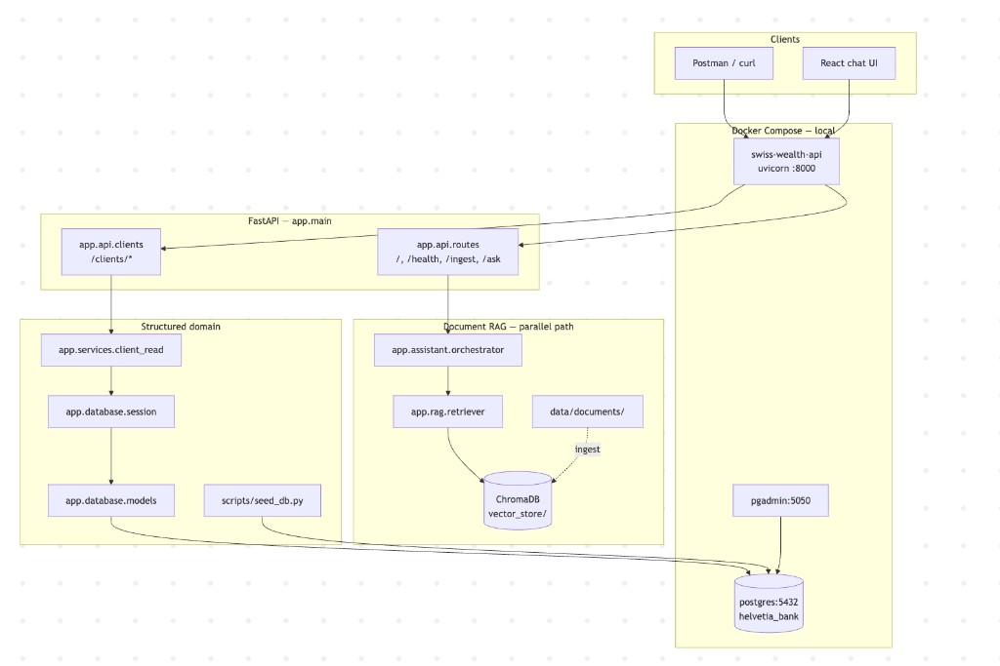
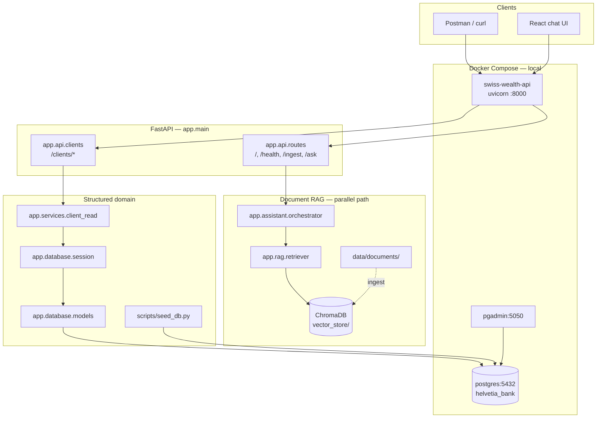

# System Architecture

**As of:** v0.3 (incremental through v0.36)

How the running application is wired: HTTP entrypoints, services, and data stores.

## Runtime overview



<details>
<summary>Mermaid source (editable)</summary>



</details>

## Request paths

| Path | Router | Backend | Data store |
| ---- | ------ | ------- | ---------- |
| `GET /`, `GET /health` | `app.api.routes` | — | — |
| `POST /ingest` | `app.api.routes` | `app.rag.ingest` | ChromaDB |
| `POST /ask` | `app.api.routes` | `app.assistant.orchestrator` → RAG | ChromaDB + LLM |
| `GET /clients/{ref}` | `app.api.clients` | `app.services.client_read` | PostgreSQL |
| `GET /clients/{ref}/accounts` | `app.api.clients` | `app.services.client_read` | PostgreSQL |
| `GET /clients/{ref}/transactions` | `app.api.clients` | `app.services.client_read` | PostgreSQL |
| `GET /clients/{ref}/interactions` | `app.api.clients` | `app.services.client_read` | PostgreSQL |
| `GET /clients/{ref}/service-requests` | `app.api.clients` | `app.services.client_read` | PostgreSQL |

`{ref}` is a client UUID or stable `client_code` (e.g. `CLI-SCEN-01`).

## Layering (structured domain)

```text
HTTP request
  → app/api/clients.py          (routing, 404)
  → app/services/client_read.py (queries, mapping)
  → app/schemas/clients.py      (Pydantic response shapes)
  → app/database/models/        (SQLAlchemy ORM)
  → PostgreSQL
```

## Local stack

| Service | Image / build | Port | Role |
| ------- | ------------- | ---- | ---- |
| `api` | `Dockerfile` | 8000 | FastAPI + uvicorn |
| `postgres` | `pgvector/pgvector:pg16` | 5432 | Domain + knowledge (pgvector) |
| `pgadmin` | `dpage/pgadmin4:8` | 5050 | DB inspection UI |

API connects to Postgres via `DATABASE_URL` host `postgres` inside Compose.

## Related docs

- Business domain: [domain.md](domain.md)
- Table and column detail: [data-model.md](data-model.md)
- Current DB tables and relationships: [database-schema.md](database-schema.md)
- PostgreSQL decision record: [../adr/ADR-001-postgresql.md](../adr/ADR-001-postgresql.md)
- pgvector decision record: [../adr/ADR-002-pgvector.md](../adr/ADR-002-pgvector.md)
