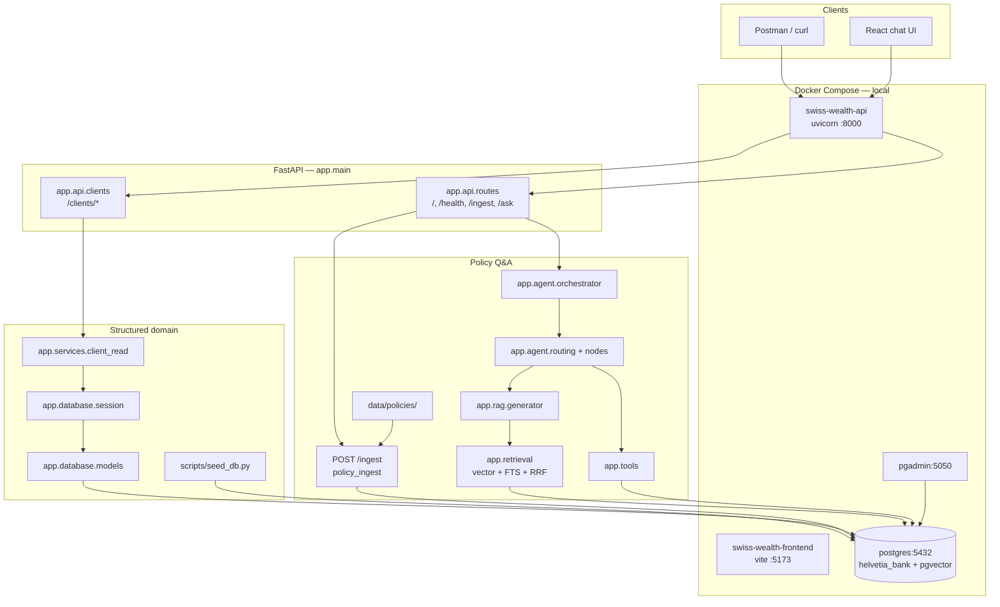

# System Architecture

**As of:** v0.7 (bounded ReAct agent + evidence chips; Compose includes local frontend)

How the running application is wired: HTTP entrypoints, services, and data stores.

## Runtime overview



## Request paths

| Path | Router | Backend | Data store |
| ---- | ------ | ------- | ---------- |
| `GET /`, `GET /health` | `app.api.routes` | — | — |
| `POST /ingest` | `app.api.routes` | `app.rag.policy_ingest` | PostgreSQL + pgvector |
| Policy ingest (CLI) | — | `scripts/ingest_policies.py` | PostgreSQL + pgvector |
| `POST /ask` | `app.api.routes` | `app.agent.orchestrator` → hybrid retrieval → LLM | PostgreSQL + LLM |
| `GET /actors` | `app.api.actors` | `app.services.actor_read` | PostgreSQL |
| `GET /actors/{code}/workspace` | `app.api.actors` | `app.services.actor_read` | PostgreSQL |
| `GET /clients` | `app.api.clients` | `app.services.client_read` / `actor_read` | PostgreSQL |
| `GET /clients/{ref}` | `app.api.clients` | `app.services.client_read` | PostgreSQL |
| `GET /clients/{ref}/accounts` | `app.api.clients` | `app.services.client_read` | PostgreSQL |
| `GET /clients/{ref}/transactions` | `app.api.clients` | `app.services.client_read` | PostgreSQL |
| `GET /clients/{ref}/interactions` | `app.api.clients` | `app.services.client_read` | PostgreSQL |
| `GET /clients/{ref}/service-requests` | `app.api.clients` | `app.services.client_read` | PostgreSQL |
| `GET /policies` | `app.api.policies` | `app.services.policy_read` | PostgreSQL |
| `GET /policies/{document_id}` | `app.api.policies` | `app.services.policy_read` | PostgreSQL |

Optional header ``X-Helvetia-Actor: EMP-####`` selects a demo employee identity (not login). Relationship managers see assigned clients only; policies and `/ask` retrieval respect ``allowed_roles``. Full RBAC is out of scope for this release.

`{ref}` is a client UUID or stable `client_code` (e.g. `CLI-SCEN-01`).
`{document_id}` is a stable policy code (e.g. `POL-KYC-001`).
`{code}` is a stable `employee_code` (e.g. `EMP-0001`).

## Layering (structured domain)

```text
HTTP request
  → app/api/clients.py
  → app/services/client_read.py
  → app/schemas/clients.py
  → app/database/models/
  → PostgreSQL
```

## Layering (policy `/ask`)

```text
HTTP POST /ask
  → app/agent/orchestrator.py (bounded runner)
  → app/agent/routing.py + nodes/ (classify → agent_turn loop: call_tool | search_policies | finish → rewrite → generate)
  → app/tools (selected read-only client tools when client_ref present)
  → app/rag/generator.py
  → app/retrieval (vector + FTS + RRF, active filters)
  → PostgreSQL knowledge_* tables
  → LLM grounded answer + sources
```

## Local stack

| Service | Image / build | Port | Role |
| ------- | ------------- | ---- | ---- |
| `api` | `Dockerfile` (migrate on start) | 8000 | FastAPI + uvicorn |
| `frontend` | `frontend/Dockerfile` (Vite dev) | 5173 | Chat UI (local DX; prod on Vercel) |
| `postgres` | `pgvector/pgvector:pg16` | 5432 | Domain + knowledge (pgvector) |
| `pgadmin` | `dpage/pgadmin4:8` | 5050 | DB inspection UI |

API connects to Postgres via `DATABASE_URL` host `postgres` inside Compose.  
Browser calls the API at `http://localhost:8000` (`VITE_API_URL`), not the Compose hostname `api`.  
Ingest policies: `POST /ingest` or `docker compose exec api python scripts/ingest_policies.py`.  
Seed clients: `docker compose exec api python scripts/seed_db.py`.

## Related docs

- Business domain: [domain.md](domain.md)
- Table and column detail: [data-model.md](data-model.md)
- Current DB tables and relationships: [database-schema.md](database-schema.md)
- PostgreSQL decision record: [../adr/ADR-001-postgresql.md](../adr/ADR-001-postgresql.md)
- pgvector decision record: [../adr/ADR-002-pgvector.md](../adr/ADR-002-pgvector.md)
- Hybrid retrieval decision record: [../adr/ADR-003-hybrid-retrieval.md](../adr/ADR-003-hybrid-retrieval.md)
