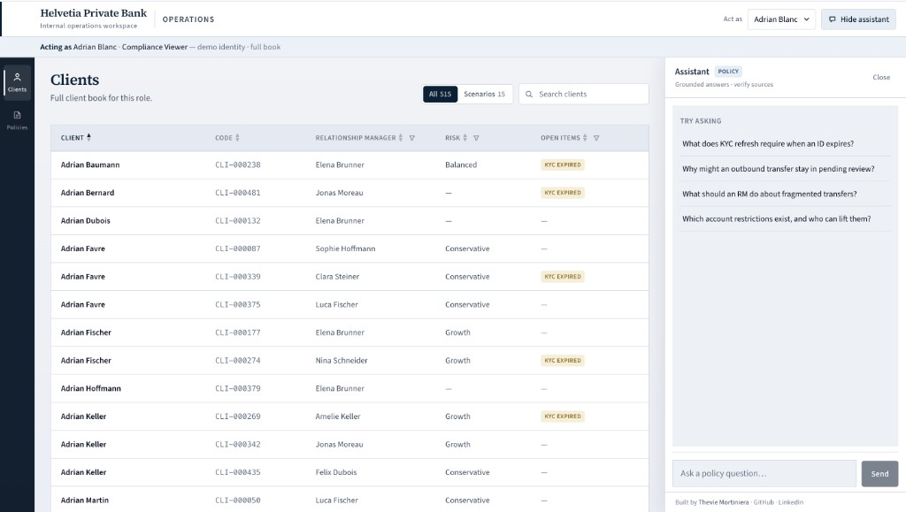
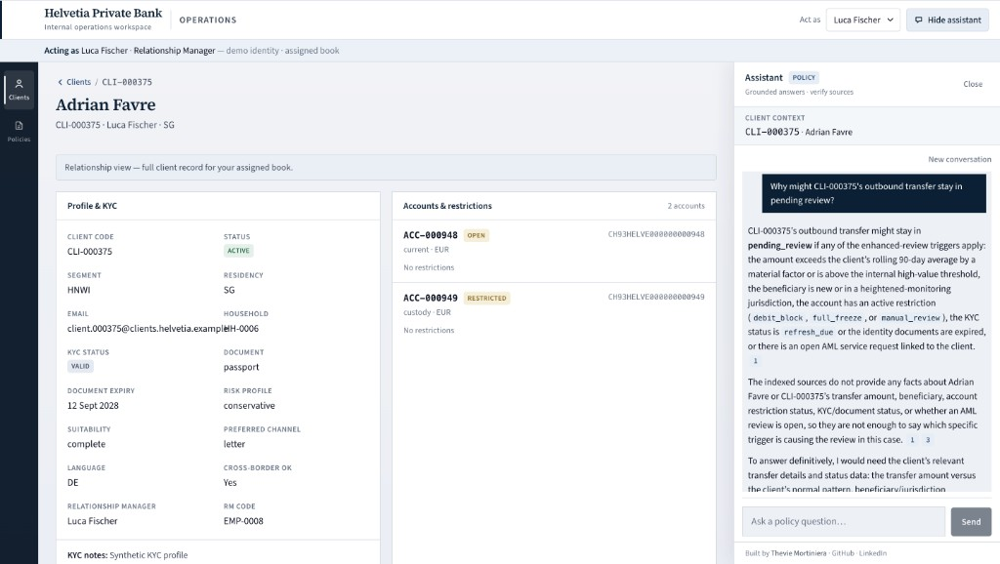
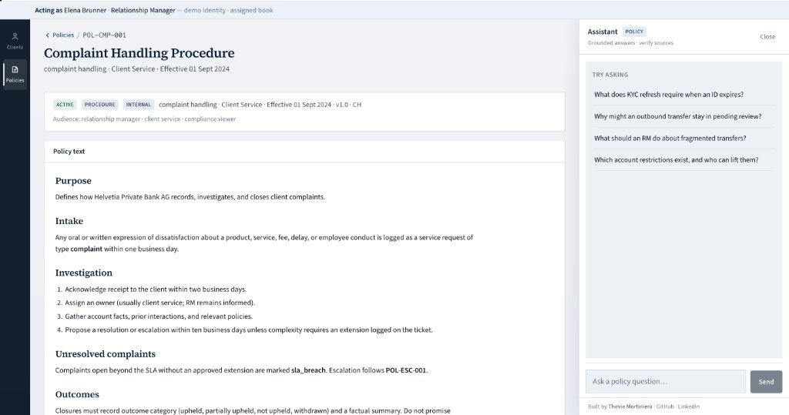

# Helvetia Operations — Frontend

React UI for the Helvetia operations workspace. Structured client/policy surfaces are the primary work area; the policy assistant is a docked panel that calls `POST /ask`.

**Live app:** [swiss-wealth-rag-assistant.vercel.app](https://swiss-wealth-rag-assistant.vercel.app)

## Stack

- React 19 + TypeScript
- Vite
- Tailwind CSS v4
- Fetch API (no extra HTTP client)

## Features

- Operations shell: brand chrome, left nav rail, Act-as employee picker
- Demo identity banner (`X-Helvetia-Actor`) — not login; real RBAC is a later release
- Client directory with column sort/filter, profile/KYC, accounts, transactions, service requests, and interactions
- Role-driven client detail panel order from workspace API
- Policies catalog with searchable list and policy detail reader (role-scoped when acting as)
- Collapsible assistant dock with selected-client context, conversation thread, and source cards
- Error handling for API failures

## Screenshots







## Project structure

```
src/
  api/
    banking.ts                # /clients list + detail endpoints
    actors.ts                 # /actors + workspace
    ask.ts                    # POST /ask
    http.ts                   # Fetch helper + actor header
    types.ts                  # Shared API types
  components/
    ui/                       # Reusable primitives (Button, Modal, DataTable…)
    shell/                    # App chrome (AppShell, TopBar, ActorSelect…)
    workspace/                # Clients / Policies work surface
    assistant/                # Dock, chat, rich text, sources
  hooks/
    useActorSession.ts        # Act-as employee + workspace
    useChat.ts                # Conversation state + /ask calls
    useClients.ts             # Directory list + column filters
    useClientDetail.ts        # Profile + activity panels
    usePolicies.ts            # Policy catalog
  types/
    workspace.ts              # Nav ids
    chat.ts                   # Message model
  utils/
    cn.ts                     # className helper
    clientDisplay.ts          # Labels, money, status tones
    personaView.ts            # Selected-client + dock prompt helpers
    listPreview.ts            # Panel list truncation
    tableSort.ts              # Column sort helpers
    paths.ts                  # path display helpers
    richText.ts               # Pure markdown-lite parser
    sourceDisplay.ts          # Source headings / relevance
  App.tsx
  main.tsx
```

## Local setup

**Option A — full stack via Compose** (from repo root):

```bash
docker compose up --build
```

Open `http://localhost:5173`. The Compose `frontend` service runs Vite dev and sets `VITE_API_URL=http://localhost:8000` (browser → host-mapped API). Production UI remains on Vercel.

**Option B — frontend only** (API already running):

```bash
npm install
cp .env.example .env.local
npm run dev
```

From the repo root, start the backend first if needed:

```bash
uvicorn app.main:app --reload
# or: docker compose up api postgres
```

Open `http://localhost:5173`.

### Environment variables

| Variable | Description |
| -------- | ----------- |
| `VITE_API_URL` | Backend base URL (default: `http://localhost:8000`) |

Local example (`.env.local`):

```env
VITE_API_URL=http://localhost:8000
```

Do not commit `.env` or `.env.local`. Only variables prefixed with `VITE_` are exposed to the browser.

The backend must allow `http://localhost:5173` in CORS (`app/main.py`).

## Build

```bash
npm run build
npm run preview   # optional: preview production build locally
```

## Deploy (Vercel)

1. Import the GitHub repo on [Vercel](https://vercel.com)
2. Set **Root Directory** to `frontend`
3. Add environment variable:

   | Name | Value |
   | ---- | ----- |
   | `VITE_API_URL` | `https://swiss-wealth-rag-assistant.onrender.com` |

4. Deploy
5. Add the Vercel URL to `allow_origins` in `app/main.py` and redeploy the backend on Render

## API contract

The UI sends optional demo identity on every request:

```http
X-Helvetia-Actor: EMP-0001
```

Primary reads:

```http
GET  {VITE_API_URL}/actors
GET  {VITE_API_URL}/actors/{code}/workspace
GET  {VITE_API_URL}/clients
GET  {VITE_API_URL}/policies
POST {VITE_API_URL}/ask
Content-Type: application/json

{"question": "...", "history": []}
```

`POST /ask` response shape (see backend `app/models/schemas.py`):

```typescript
{
  answer: string;
  sources: {
    institution: string;
    document_title: string;
    source_file: string;
    chunk_id: string;
    score: number;
  }[];
}
```

For backend architecture, ingestion, and deployment details, see the [root README](../README.md).
